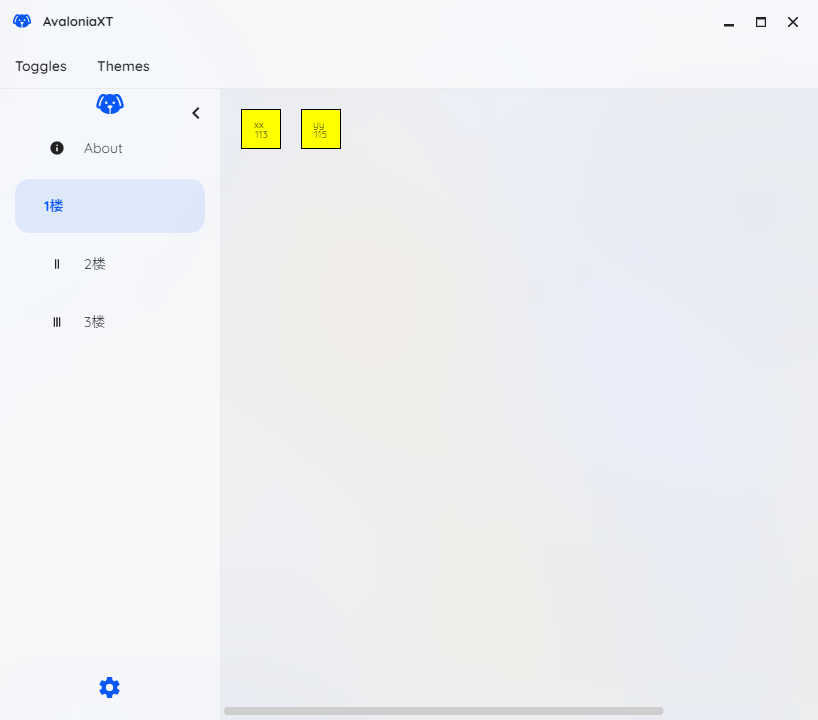

# AvaloniaXT
Avalonia App Page Helper Dll , Contains MainWindow，SukiUI，Support AOT。
```
dotnet add package AvaloniaXT --version 1.0.0
```

# 项目组成
- AvaloniaXT Nuget通用页面程序集，包含主窗口和一些通用的扩展方法。
- XTExternalPage 扩展界面程序集，包含定制化的业务界面。
- AvaloniaXT.Desktop 桌面程序启动入口。
- AvaloniaXT.Android 可以运行， Microsoft.Maui.Essentials 可以使用Essentials全部功能。
- SukiUI [引用的SukiUI项目](https://github.com/kikipoulet/SukiUI) 修改了ProgressBar的MiniHeight、添加一些控件。

# 系统界面


# 国际化支持
```
  public override void OnFrameworkInitializationCompleted()
  {
     // Lang.Resources.Culture = new CultureInfo("en-US");
     // Register.InitialCulture("en-US");    
  }

  直接编辑 Resources.resx 添加语言
```

# AOT支持
## 要点
1. 不使用反射
2.  编译绑定必须置为true   
```
<AvaloniaUseCompiledBindingsByDefault>true<AvaloniaUseCompiledBindingsByDefault>
```
3. 反序列化使用源映射
```
// 提供GetJsonOptions静态方法
var options = UrlUtilities.GetJsonOptions();
options.TypeInfoResolver = ApiJsonContext.Default;
var result = JsonSerializer.Deserialize<AdminCodeResult<EcsMainView>>(data, options);


    [JsonSerializable(typeof(AdminCodeResult<EcsMainView>))]
    public partial class ApiJsonContext: JsonSerializerContext
    {
    }
```

## SQL ORM
- 测试使用FreeSQL,Npgsql需升级到最新版本。
- 需要在启动项目中包含rd.xml
```
// 项目中包含
<ItemGroup>
		<RdXmlFile Include="rd.xml" />
</ItemGroup>


<Directives xmlns="http://schemas.microsoft.com/netfx/2013/01/metadata">
	<Application>
		
		<Assembly Name="XTExternalPage"  Dynamic="Required All">
		</Assembly>

		<Assembly Name="FreeSql"  Dynamic="Required All">
		</Assembly>
		<Assembly Name="Npgsql"  Dynamic="Required All">
		</Assembly>
	</Application>
</Directives>
```

# AvaloniaXT使用步骤
安装完 AvaloniaXT Nuget包后
## 1、启动入口 添加 Font Awesomon支持（可选）
```
 public static AppBuilder BuildAvaloniaApp()
 {
   Register.AddIcons();
   return  AppBuilder.Configure<App>()
         .UsePlatformDetect()
         .WithInterFont()
         .LogToTrace();
 }

 // 页面中使用
 <i:Icon Value="{Binding Condition}" FontSize="{Binding Width}" />
```

##  2、在App.xaml中添加页面选择器、样式、底部托盘（可选）
- 页面和弹窗VM都需要继承XTBasePage(提供GetView()方法，注入视图），弹窗还需要重写IsDialog()方法，返回true。
```
 <Application.DataTemplates>
     <xt:ViewLocator/>
 </Application.DataTemplates>

    <Application.Styles>
			
		<sukiUi:SukiTheme ThemeColor="Blue"  />

		<avalonia:MaterialIconStyles />
    
    </Application.Styles>


// 项目中包含资源，使用方式
<ItemGroup>
	<AvaloniaResource Include="Assets\**" />
</ItemGroup>


<TrayIcon.Icons>
	<TrayIcons>
		<TrayIcon Icon="/Assets/alarm.ico" Clicked="NativeMenuItem_Show"
				  ToolTipText="AvaloniaXT">
			<TrayIcon.Menu>
				<NativeMenu>
					<NativeMenuItem Header="Settings">
						<NativeMenu>
							<NativeMenuItem Header="Show" Click="NativeMenuItem_Show"  />
							<NativeMenuItem Header="Exit" Click="NativeMenuItem_Click"  />							
						</NativeMenu>
					</NativeMenuItem>
				</NativeMenu>
			</TrayIcon.Menu>
		</TrayIcon>
	</TrayIcons>
</TrayIcon.Icons>


 private void NativeMenuItem_Click(object? sender, EventArgs e)
 {
     if (Application.Current?.ApplicationLifetime is IClassicDesktopStyleApplicationLifetime lifetime)
     {
         lifetime?.Shutdown();
         
     }
 }

 private void NativeMenuItem_Show(object? sender, EventArgs e)
 {
     if (Application.Current?.ApplicationLifetime is IClassicDesktopStyleApplicationLifetime lifetime)
     {
         var window = lifetime?.MainWindow;
         window.WindowState = WindowState.Normal;
         window.Show();


     }
 }
```
## 3、在App中注入服务
```
 var services = new ServiceCollection();

 // 注入 AvaloniaXT中的服务
 services.InitialXTServices();

 // 注入业务界面服务
 // services.AddSingleton<DbService>();

 // 注入界面，界面ViewModel需要
 services.AddSingleton<XTPageBase, PhoneTestViewModel>();

 // 注入Dialog界面，需要定义Key
 services.AddKeyedSingleton<XTPageBase, SearchDialogViewModel>("Search");

 // 界面配置
 services.AddSingleton<IMenuToolService, MenuToolService>();

 _provider = services.BuildServiceProvider();


  public override void OnFrameworkInitializationCompleted()
 {
     // 添加 AvaloniaXT 的方法
     ApplicationLifetime?.InitialCompleted(_provider);

     base.OnFrameworkInitializationCompleted();
 }
```

# 辅助方法

## 视图选择器
```
 public class EcsTagSelector : DataTemplateSelector
 {
     public override string GetKey(object? param)
     {
         var tag = param as UnitTagModel;
         return tag.Type.ToString();
     }
     
 }

<ItemsControl.DataTemplates>
	<selector:EcsTagSelector>		
		<DataTemplate x:Key="Other">
			<cp:UnitOther></cp:UnitOther>
		</DataTemplate>
		<!--<DataTemplate x:Key="XX">
			<cp:UnitXX></cp:UnitXX>
		</DataTemplate>-->
	</selector:EcsTagSelector>
</ItemsControl.DataTemplates>

```

## Dialog弹窗
```
// windows窗体
await SukiHost.ShowToast();
// 支持所有平台
InteractiveContainer.ShowToast()
```


